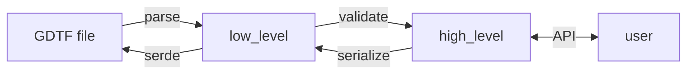

:construction: This file for contributors is a work in progress. If you can't find something here you want to know, do
not hesitate even a second to open an issue: https://github.com/Firionus/opengdtf/issues/new :relaxed:

## Architecture



A GDTF file is first parsed into a low level form which closely resembles a GDTF file, such that GDTF can also be serialized from it easily with quick-xml and serde. In this first parsing step, only *local* validation is applied, i.e. each field or element itself is validated, but not the conatainer (e.g. uniqueness of names) or the links between elements.  
In a second step, a high level representation is built from the low level one, piece-by-piece with fully validating APIs.  
To go the other way, a low level form is first created by hand-written code and then serialized with quick-xml and serde. The parser is hand-written based on roxmltree to enable more fine-grained error handling compared to serde. 

The layered architecture results in more scattered and repeating code but was chosen because a previous version combined parsing and validation in one step which resulted in very long, less readable code. Trying to do everything in one step while scattering parsing, validation and domain logic all over the place is known as shotgun parsing, an anti-pattern. 

## Example File Tests

### Setup

Running the tests for this library requires manually downloading some GDTF files from gdtf-share.com:

1. Download GDTF files  
   Log into GDTF Share and go to https://gdtf-share.com/share.php?page=downloadFiles. Check "latest revision" and then
   download the files for the Manufacturers "Robe Lighting", "ARRI" and "Ayrton".
2. Extract GDTF files and place in `tests/example_files/examples`
3. Run `cargo test`  
   The test results should tell you whether all expected fixtures are present and whether expected results exist for
   every fixture. If these tests fail, you should not feel too bad. Likely, nothing is broken, you just have a slightly
   different set of example files than the last developer.  
   The more important test is `expected_toml_matches_examples_output`. If there are differences here, there is a change
   in the library compared to the library version with which the example file tests were last updated.

### Commands

Force update of `tests/example_files/expected.toml` (will never
overwrite fixtures whose outputs stays the same or are absent from your examples): 
```sh
cargo run --bin update_expected
``` 

Dump debug output of examples files to `tests/example_files/outputs`: 
```
cargo run --bin output_examples
```

### Background

This library has to ensure it works well with the output of the official GDTF Builder, which is not always standard
conformant. Further, when this library evolves, we should have a mechanism to detect regressions with a wide range of
real world examples. 

This is currently achieved with the example file testing, which is a modified form of [snapshot
testing](https://notlaura.com/what-is-a-snapshot-test/), where the output of tests is serialized and commited to the
repository for future comparison. This ensures changes are in the future are detected. 

Since I do not want to host a large array of GDTF files in this repository (due to licensing and size concerns), only
very few demo files I created myself are commited in the repository. Other files have to be downloaded by each developer
individually. This doesn't scale well to many developers, but for the moment it's what we have.

The expected output for the tests is saved in `tests/example_files/expected.toml`. Matching the example files to the
expected output is achieved with a hash of the extracted filenames and file contents in the GDTF archive. 

## Error Handling Notes

Basically, whenever you do something, it can go wrong. Because I want this
library to be really resistant to errors, this can be quite cumbersome to handle. 

What I learned is this: Whenever you might have to give up on the remaining code
on error, you want to be in a function that returns `Result<.., ProblemAt>`.
Then, when something bad might happen, there are two ways to handle it:
- You can fix the problem right away. Create a problem, push it, and do the fix. (like `.ok_or_handled_by("stuff", p).unwrap_or(default)`)
- You can't fix the problem. Create a ProblemAt and return to the caller. (like `.ok_or_else(|| Problem::New.at(&n))?`)

Further, you should always check the `parse_xml` traits to see whether a utility
function already does what you need.

## Validation Notes

Validations during parsing should be divided into two parts:
- Parsing validation, e.g. that a `Name` does not contain forbidden chars or
  that a Geometry referenced by name does in fact exist in the Domain model and
  its index can be retrieved
- Domain validation, e.g. that the referenced Geometry of a Mode is top-level

One should take care to put these validations where they belong, i.e. parsing
validation belongs into the `parser` module, domain validation into the `gdtf`
module.

## Benchmark

A little comparison with [gdtf_parser](https://github.com/michaelhugi/gdtf_parser) is available by running

```sh
cargo run --bin comparison_against_gdtf_parser --release
```